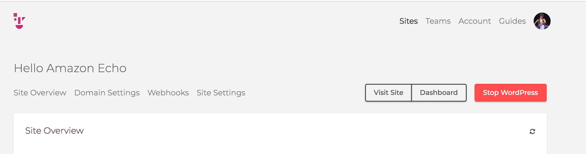
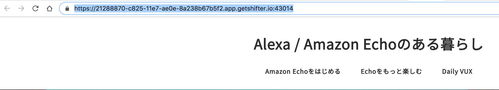
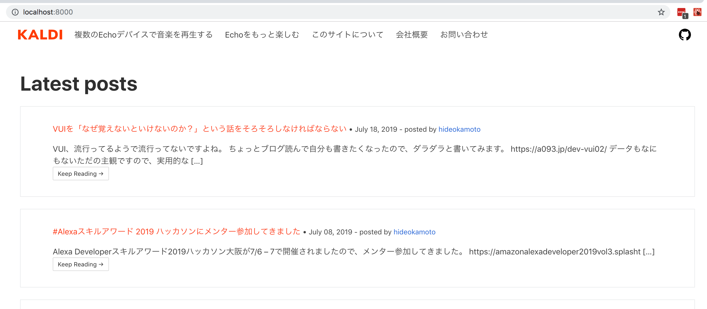

# Step2: GatsbyでWordPressのデータをインポートする
Gatsbyのプラグインを利用して、WordPressの記事をGatsby(React)で表示させましょう。

```bash
$ npx gatsby new wp-shifter https://github.com/GatsbyCentral/gatsby-starter-wordpress
$ cd wp-shifter
```

## 2-1: ShifterでWordPressを起動する
ShifterのDashboardから、WordPressを起動させましょう。


[Visit Site]をクリックし、アドレスバーからWordPressのURLを''https://''と最後の`/`は含めずに、コピーします。
※例：21288870-c825-11e7-ae0e-8a238b67b5f2.app.getshifter.io:43014



## 2-2: GatsbyでWordPressのデータをインポートする
wp-shifterのディレクトリへ移動します。
先程コピーしたURLを`gatsby-config.js`の`plugins[].options.baseUrlに貼り付けます。


### 例
```javascript
module.exports = {
  siteMetadata: {
    title: 'Gatsby + WordPress Starter',
  },
  plugins: [
    'gatsby-plugin-react-helmet',
    'gatsby-plugin-sass',
    {
      resolve: 'gatsby-source-wordpress',
      options: {
        // The base url to your WP site.
        baseUrl: '21288870-c825-11e7-ae0e-8a238b67b5f2.app.getshifter.io:43014',
        // WP.com sites set to true, WP.org set to false
        hostingWPCOM: false,
        // The protocol. This can be http or https.
        protocol: 'https',
        // Use 'Advanced Custom Fields' Wordpress plugin
        useACF: false,
        auth: {},
        // Set to true to debug endpoints on 'gatsby build'
        verboseOutput: false,
      },
    },
    'gatsby-plugin-sharp',
    'gatsby-transformer-sharp',
    {
      // Removes unused css rules
      resolve:'gatsby-plugin-purgecss',
      options: {
        // Activates purging in gatsby develop
        develop: true,
        // Purge only the main css file
        purgeOnly: ['/all.sass'],
      },
    }, // must be after other CSS plugins
    'gatsby-plugin-netlify', // make sure to keep it last in the array
  ],
}

```

## 2-3: Gatsbyでサイトをビルドする
それでは実際にWordPressサイトのデータをGatsby経由で表示させましょう。
Gatsbyは`npm start`または`yarn start`でローカル開発モードが起動します。

### npm
```bash
$ pwd
/PATH/TO/wp-shifter
$ npm install
$ npm start
```

### yarn
```bash
$ pwd
/PATH/TO/wp-shifter
$ yarn
$ yarn start
```

### Note: `start`コマンドでのエラーメッセージについて
WP APIを総ナメする仕様上、`start`コマンド実行中にいくつか赤色のメッセージが表示されます。
しかしこれはログインが必要なAPIなどにアクセスを試行していることが原因ですので、以下のようなメッセージについては無視して問題ありません。

```bash
success onPreBootstrap — 0.005 s
⠈ source and transform nodes -> wordpress__shifter_v1 fetched : 1
⢀ source and transform nodesThe server response was "404 Not Found"
Inner exception message : "URL とリクエストメソッドに一致するルートがありません"
⢀ source and transform nodes -> wordpress__shifter_urls fetched : 1
⢀ source and transform nodesThe server response was "401 Unauthorized"
Inner exception message : "Sorry, you are not allowed to do that."
⠐ source and transform nodes -> wordpress__bogo_v1 fetched : 1
⡀ source and transform nodes -> wordpress__bogo_languages fetched : 1
⠁ source and transform nodes -> wordpress_____experimental fetched : 1
⡀ source and transform nodesThe server response was "500 Internal Server Error"
Inner exception message : "サイドバーを読み込む権限がありません。"
⠐ source and transform nodes -> wordpress__yoast_v1 fetched : 1
⡀ source and transform nodesThe server response was "401 Unauthorized"
Inner exception message : "その操作を実行する権限がありません。"
```

### サイトを確認する
startに成功すると、以下のようなメッセージが表示されます。

```bash
You can now view gatsby-starter-wordpress in the browser.

  http://localhost:8000/

View GraphiQL, an in-browser IDE, to explore your site's data and schema

  http://localhost:8000/___graphql

Note that the development build is not optimized.
To create a production build, use gatsby build
```

http://localhost:8000/にアクセスすると、GatsbyがWordPressの記事を表示している状態が確認できます。


## 2-4: [opt] ビルドして公開できるHTMLファイルを生成する

`yarn run build`または`npm run build`を実行すると、Gatsbyが静的なHTMLファイルを生成します。

`yarn start` / `npm start`を`Ctrl + C`などで停止した後にビルドコマンドを実行しましょう。

```bash
$ yarn run build
or
$ npm run build

success Building production JavaScript and CSS bundles — 5.272 s
⠁  
gatsby-plugin-purgecss:
 Previous CSS Size: 197.13 KB
 New CSS Size: 11.60 KB (-94.12%)
 Removed ~185.53 KB of CSS

success Building static HTML for pages — 0.515 s — 9/9 39.61 pages/second
info Done building in 25.832 sec
✨  Done in 26.45s.
```

ビルドされたHTMLは`public/`ディレクトリに保存されます。
`cd public && php -S localhost:8001`などで生成されたファイルを見てみましょう。

### Troubleshooting: buildがfailする

#### WebpackError: TypeError: Cannot destructure property `wordpressPost` of 'undefin  ed' or 'null'.

```bash
error Building static HTML for pages failed

See our docs page on debugging HTML builds for help https://goo.gl/yL9lND

  67 | 
  68 | const BlogPost = ({ data }) => {
> 69 |   const { wordpressPost: post } = data
     |                                   ^
  70 | 
  71 |   return (
  72 |     <Layout>


  WebpackError: TypeError: Cannot destructure property `wordpressPost` of 'undefin  ed' or 'null'.
```

WordPressのパーマリンクが日本語になっていると、importに失敗します。
WordPress管理画面から、パーマリンクの設定を``に変更してください。

#### GraphQLError: Cannot query field "allWordpressPage" on type "Query". Did you mea  n "allWordpressTag", "allWordpressPost", "allWordpressWpTypes", "wordpressTag",   or "allWordpressWpUsers"?
```bash

GraphQL request (3:7)
2:     {
3:       allWordpressPage {
         ^
4:         edges {

error gatsby-node.js returned an error


  GraphQLError: Cannot query field "allWordpressPage" on type "Query". Did you mea  n "allWordpressTag", "allWordpressPost", "allWordpressWpTypes", "wordpressTag",   or "allWordpressWpUsers"?
```

以下のいずれかの条件が満たせていません。

- １つ以上の投稿が公開されている
- １つ以上の固定ページが公開されている
- １つ以上のタグが設定されている
- １つ以上のカテゴリーが設定されている


## Checklist

- [ ] `npm start` or `yarn start`でGatsbyサイトをローカル表示
- [ ] ローカル表示したサイトにWordPressで書いたコンテンツが表示されている
- [ ] `npm run build` or `yarn run build`でGatsbyのビルドに成功
- [ ] ビルドしたサイトにWordPressで書いたコンテンツが表示されている

## Step2: まとめ

Step2はGatsbyでWordPressサイトのデータをインポートする方法を体験しました。  
この方法を使うことで、WordPressのテーマ・PHPを利用することなく、React / Gatsbyを利用してWordPressサイトを構築することができます。

通常のWordPressサイトであれば、あとはサイト更新の度に`yarn run build`を実行すればOKです。
ただしShifterではWordPressのURLが起動の度に変更されます。  
そこでStep3では、常に変わるWordPressのURLに対応しつつ、WordPress側の操作だけでGatsbyのビルド・デプロイを行う方法を学びます。

## Navigation
- [Step1: WordPressサイトのセットアップ](./step1.md)
- NOW -> [Step2: GatsbyでWordPressのデータをインポートする](./step2.md)
- [Step3: Shifter Webhookで毎回変わるWordPressにURLに対応する](./step3.md)