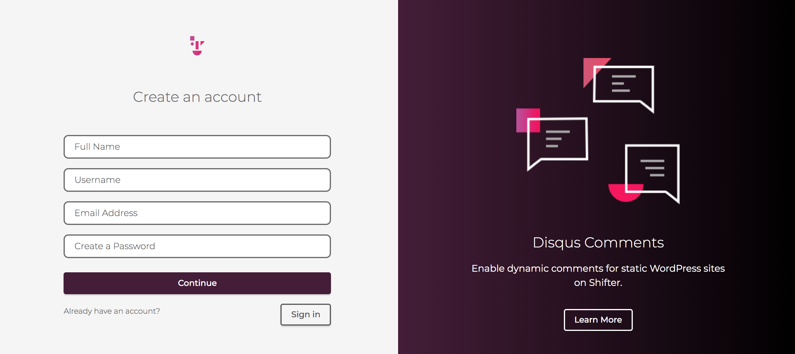
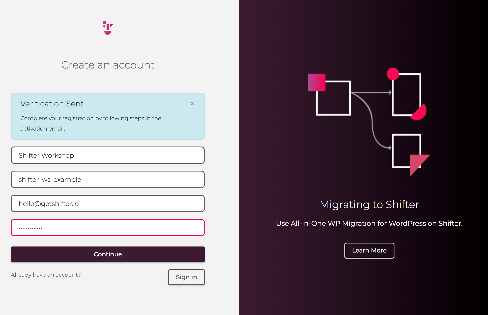
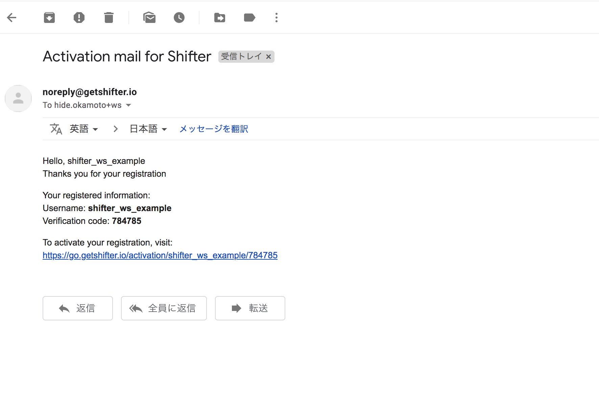
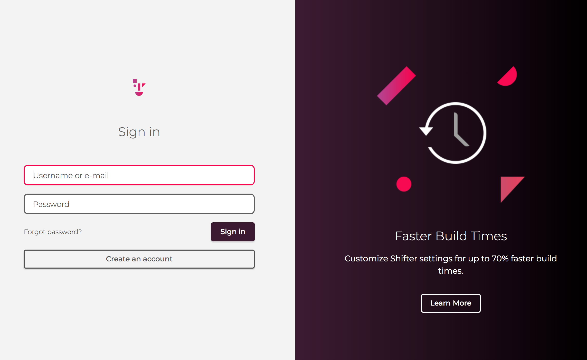

# Step1: アカウントの作成
## 1-1: フォーム情報の入力
https://go.getshifter.io/register からアカウントを作成しましょう。

### 必要な情報
- 氏名
- ユーザー名
- メールアドレス
- パスワード（8桁以上、半角英数字）

## 1-2: 確認メールをチェック
アカウントが作成できると、メールアドレスの確認が行われます。
入力したメールアドレスに以下のようなメールが届いていますので確認しましょう。

メール内にあるURLをクリックして、ログイン画面に自動で遷移すればOKです。

## 1-3: ダッシュボードにログインする
先程入力したユーザー名またはメールアドレスと、パスワードでログインしましょう。

Dashboardが表示されればOKです。

## Checklist

- [ ] アカウント登録が成功した
- [ ] 確認メールを受信した
- [ ] アカウントの確認が成功した
- [ ] ダッシュボードにログインできた

## Navigation

- Now -> [Step1: アカウントの作成](./step1.md)
- [Step2: サイトの作成と管理画面の操作](./step2.md)
- [Step3: HTMLの生成（Generate）と公開](./step3.md)
- [Step4: トライアルモードからFreeプランへ移行する](./step4.md)