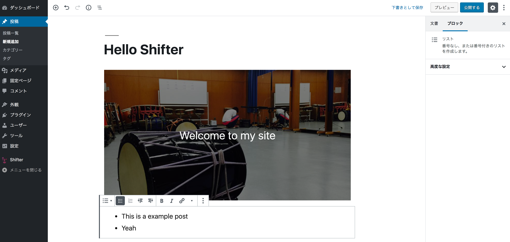

# Step2: サイトの作成と管理画面の操作

早速ShifterでWordPressサイトをセットアップしましょう。

## 2-1: サイトを作成する
[Create New]をクリックします。

サイト名を入力しましょう。  
TeamはDefaultでOKです。

[Create Site]をクリックして、サイト管理画面に移動すればOKです。

## 2-2: WordPressサイトにアクセスする
WordPressのセットアップが終わると、[Visit Site] / [Dashboard]の2ボタンが表示されます。

[Visit Site]をクリックすると、初期状態のWordPressサイトが表示されます。

[Dashbaord]をクリックすると、WordPressの管理画面に自動ログインします。

## 2-3: WordPressを止めてみる
[Visit Site]と[Dashboard]それぞれをクリックしましょう。

その後、Shifterの管理画面から、[Steop WordPress]をクリックします。

WordPressサイト・管理画面どちらもリロードすると、アクセスできなくなります。

## 2-4: WordPressを再起動する

[Start WordPress]をクリックして、WordPressを再起動しましょう。

[Visit Site]と[Dashboard]が表示されるまですこし待ちます。

URL（Port）が変わっているため、再起動しても2-2でアクセスしたURLからはWordPressにアクセスできません。

## 2-5: ログインURLの共有
ShifterのWordPressでは、URLだけでログインする仕組みが用意されています。

WordPress管理画面の[Users > All Users]に移動しましょう。

[Magic Link]のリンク下にある[Copy]をクリックします。

別のブラウザやシークレットウィンドウなどで、コピーしたURLにアクセスしてみましょう。
WordPressにログインできていることがわかります。

このようにShifterでは、WordPress起動後他のユーザーが簡単にログインできる仕組みを用意しています。

## 2-6: 記事の作成と日本語化
Shifterで起動するWordPressはデフォルトで以下の状態です。

- 投稿・固定ページ0件
- 英語

### 日本語化
[Settings > General]から言語・タイムゾーンを変更できます。
以下の設定で日本化しましょう。

- Site Language: 日本語
- Timezone: Tokyo または UTC+9

[Save Changes]をクリックすると、日本語になります。

### 投稿の作成
せっかくなので、1記事なにか書いてみましょう。  
[投稿 > 新規追加]から記事を作成できます。

  

## Checklist

- [ ] Shifterでサイトを立ち上げる
- [ ] WordPressを起動し、アクセスする
- [ ] WordPressを停止すると、アクセスできなくなることを確認する
- [ ] 起動の度にURLの一部が変わることを確認する
- [ ] パスワードレスにログインする方法を確認する

## Navigation

- [Step1: アカウントの作成](./step1.md)
- NOW -> [Step2: サイトの作成と管理画面の操作](./step2.md)
- [Step3: HTMLの生成（Generate）と公開](./step3.md)
- [Step4: トライアルモードからFreeプランへ移行する](./step4.md)
- [Advanced challenge](./advanced.md)