# Step3: HTMLの生成（Generate）と公開

## 3-1: Generateの開始
ShifterのDashboardから[Generate]をクリックしします。
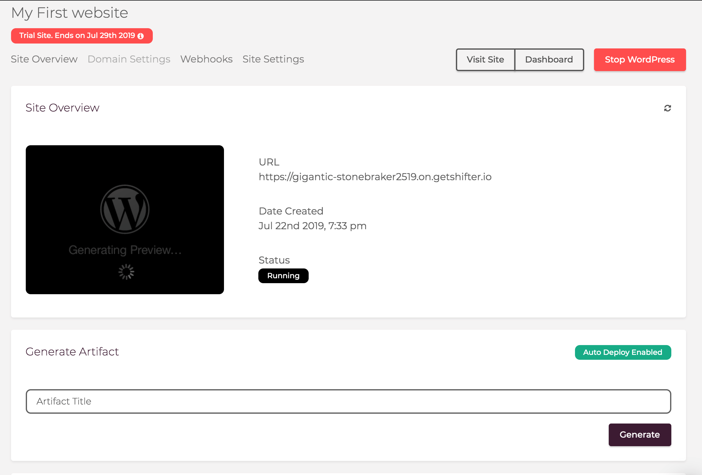

WordPressサイトが起動中の場合は、メッセージが表示されます。  
停止して問題なければ[Generate]をクリックしましょう。
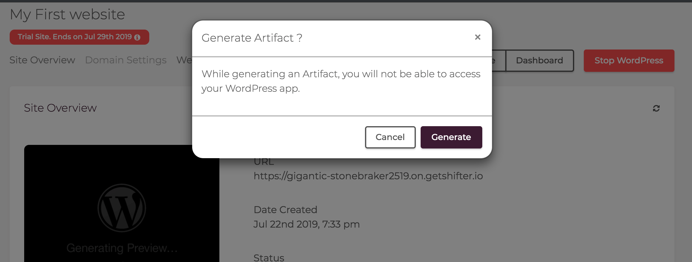

右上のWordPress操作ボタンがGenerateのステータスを表示します。
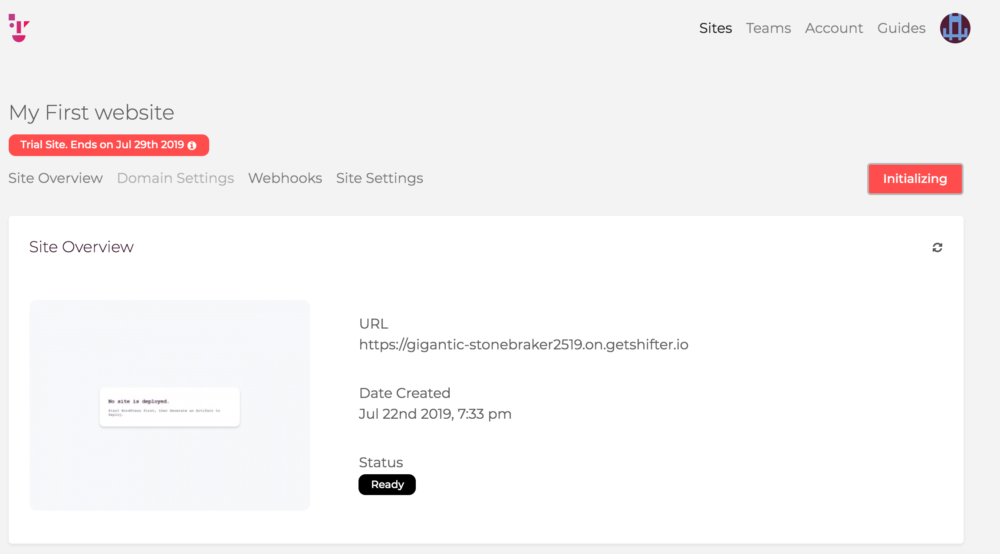

[Start WordPress]に戻ったらGenerate完了です。
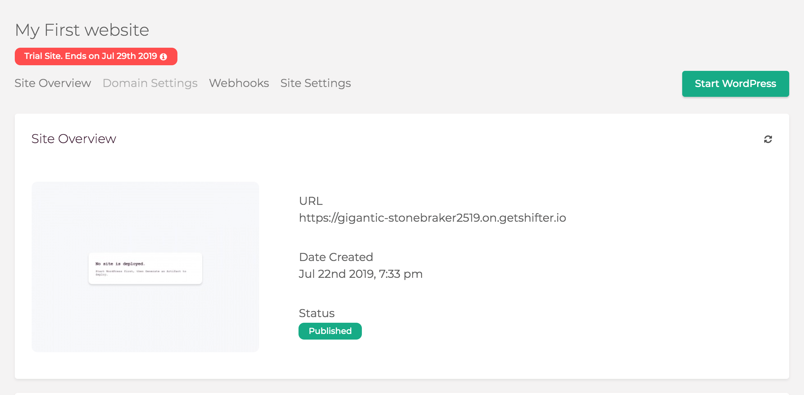

## 3-2: 公開サイトの確認
[Site Overview]の[Status]が`Published`になっていれば、公開完了です。

`URL`をクリックすると、公開されたサイトを確認できます。
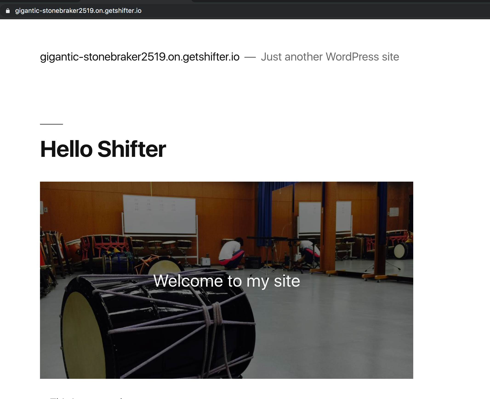

## 3-3: 自動デプロイを停止する
GenerateしたHTMLを自動公開する設定をオフにできます。
[Site Settings]の[Auto Deploy Artifact]にあるトグルをクリックしましょう。

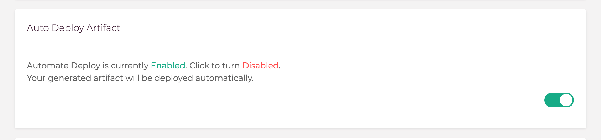

`Automate Deploy is currently Disabled.`に表示が変われば設定完了です。
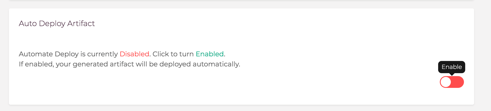

## 3-4: 自動デプロイをオフにした場合のサイト公開方法
自動デプロイをオフにした場合、[Generate]した後に[Deploy]ボタンをクリックする必要があります。

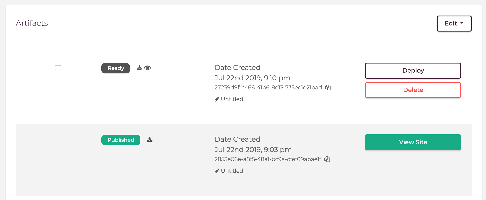

## 3-6: Previewの確認
`Ready`と表示されたArtifactは、プレビューが確認できます。  
目のアイコンをクリックしましょう。
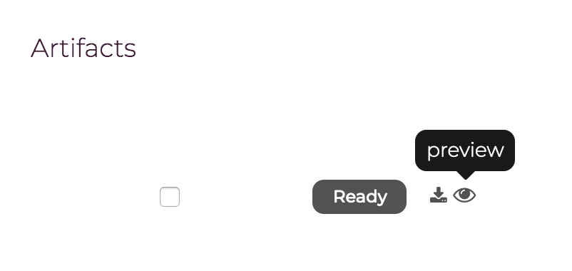

新しいウィンドウでプレビューサイトが表示されます。

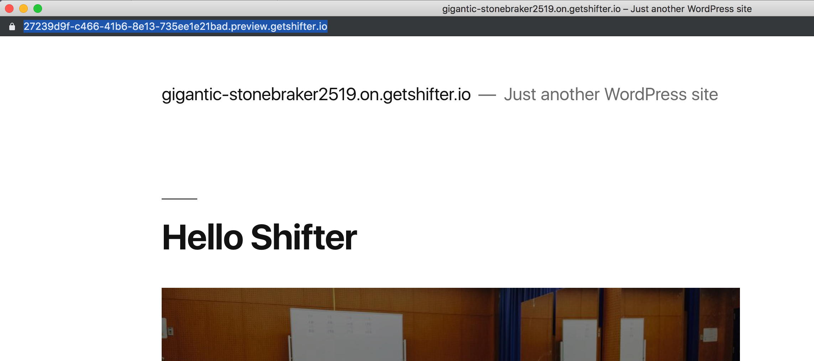

プレビューサイトは一定時間が経過すると自動で非表示になりますのでご注意ください。

## 3-6: 過去のデプロイにロールバックする
ロールバックしたいバージョンのArtifactの[Deploy]ボタンをクリックすることで、公開サイトをロールバックできます。

## Appendix-1: 不要なアーカイブページをスキップする

WordPress管理画面の[Shifter > Settings]から、不要なアーカイブページのGenerateをスキップできます。

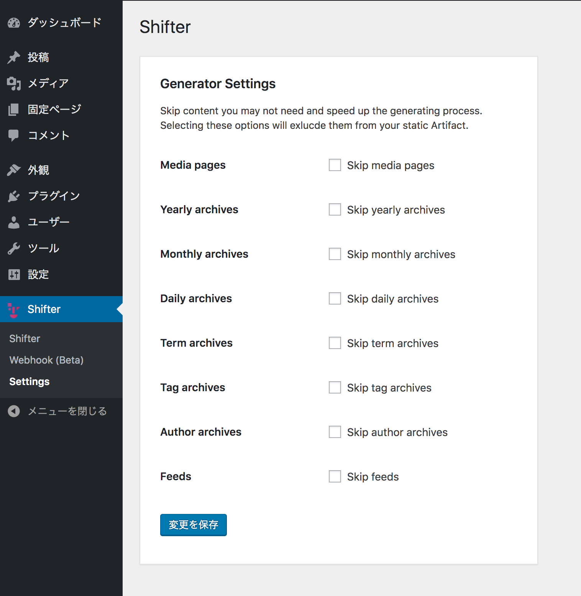

GenerateのFailが連続する場合、重要度の低いページをスキップする設定にしてお試しください。

## Appendix-2: WordPress管理画面からGenerate

WordPress管理画面からもGenerate操作ができます。
上部の管理バーから[SHifter > Generate Artifact]を選択しましょう。

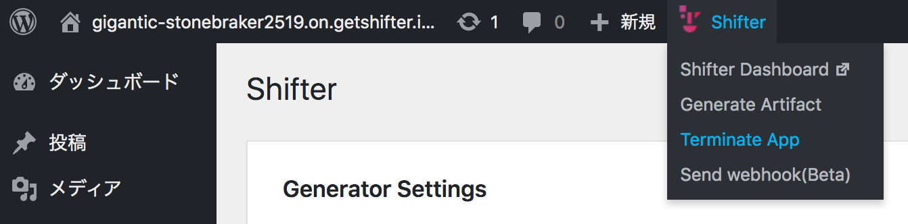

[Generate]をクリックすると、WordPressが停止し、Generateが開始されます。

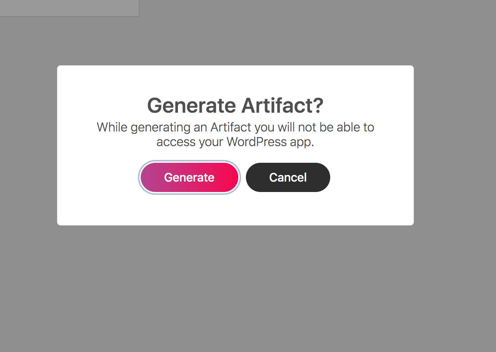

## Checklist

- [ ] WordPressサイトをGenerateする
- [ ] 公開されたサイトを確認する
- [ ] 自動デプロイをオンオフ変更する
- [ ] プレビューを確認する
- [ ] ロールバックする