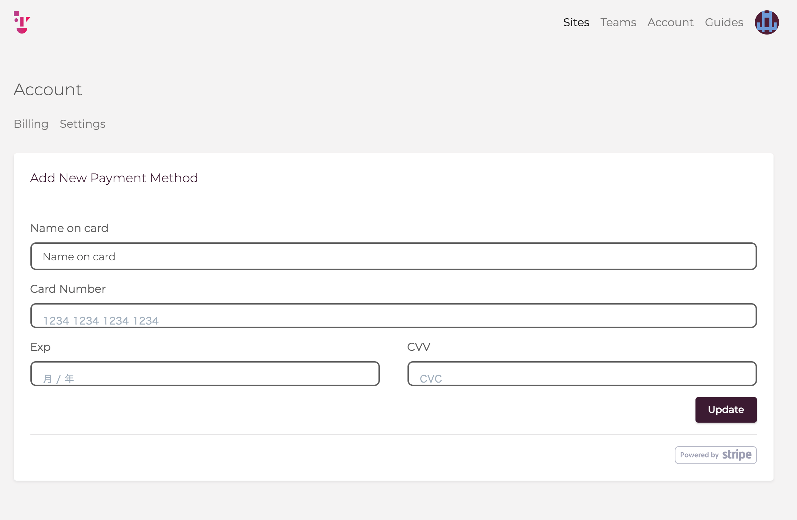

# Step4: トライアルモードからFreeプランへ移行する

最後にトライアルからFreeプランへの移行について体験しましょう。

## トライアルとFreeプラン・有料プランの違いについて

2019/07時点、それぞれは以下の違いがあります。

|Plan|できること|できないこと|課金|
|:--|:--|:--|:--|
|Trial|サイトの作成と公開|7日間で自動削除される 独自ドメインでのSSL Webhook|なし|
|Free|サイトの作成と公開|独自ドメインでのSSL Webhook|なし|
|有料プラン|サイトの作成と公開 独自ドメインでのSSL|Webhookはプラン次第|有料|

詳細はPricingページを確認してください。

https://www.getshifter.io/pricing/

## Freeプランに移行する

TrialからFreeプランへの移行は、クレジットカードの登録によって行います。

https://go.getshifter.io/admin/accounts/billings

からクレジットカードを登録しましょう。

有料プランに変更しない限り、課金は発生しませんのでご安心ください。

## Navigation

- [Step1: アカウントの作成](./step1.md)
- [Step2: サイトの作成と管理画面の操作](./step2.md)
- [Step3: HTMLの生成（Generate）と公開](./step3.md)
- Now -> [Step4: トライアルモードからFreeプランへ移行する](./step4.md)