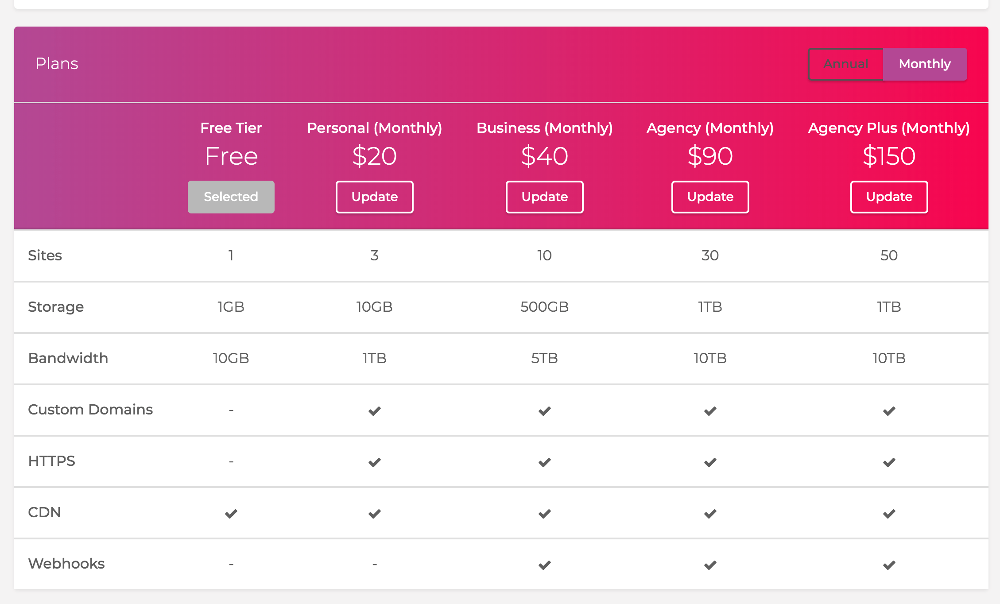

# Step1: Webhook対応プランに変更する

ShifterでWebhookを利用するためには、Webhookが利用可能なプランにアップグレードする必要があります。
Shifterのワークショップでは、参加者に期間限定のクーポンをお渡しします。

## 1-1: Coupon Codeを入力する

https://go.getshifter.io/admin/accounts/billings
の[Apply Coupon Code]からクーポンコードを入力します。

適用まですこし時間がかかります。表示が変わらない場合は、何度かリロードしてみてください。

クーポンコードが表示されれば、準備完了です。

## 1-2: プランを変更する

続いてWebhookタイププランに変更します。
https://go.getshifter.io/admin/accounts/subscription
から、[Webhooks]にチェックマークがツイているプラン（Bussiness / Monthly）を選択してください。

確認画面が表示されますので、同意します。

成功したメッセージが表示されれば、変更完了です。

## 1-3: Webhookが有効になっていることを確認する

管理しているSiteの管理画面へ移動し、[Webhooks]が開放されていることを確認しましょう。

## Checklist

- [ ] Couponを登録した
- [ ] Webhook対応プランに変更した
- [ ] Webhook設定ページが利用可能になった

## Navigation
- Now -> [Step1: Webhook対応プランに変更する](./step1.md)
- [Step2: Netlifyデプロイ用のテンプレートをインポートする](./step2.md)
- [Step3: Netlifyにサイトを作成する](./step3.md)
- [Step4: ShifterサイトからWebhookでデプロイする](./step4.md)
- [Tier Down: プランをダウングレードする](./tierdown.md)
- [Advanced challenge](./advanced.md)