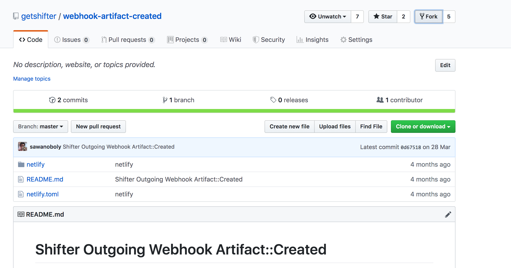
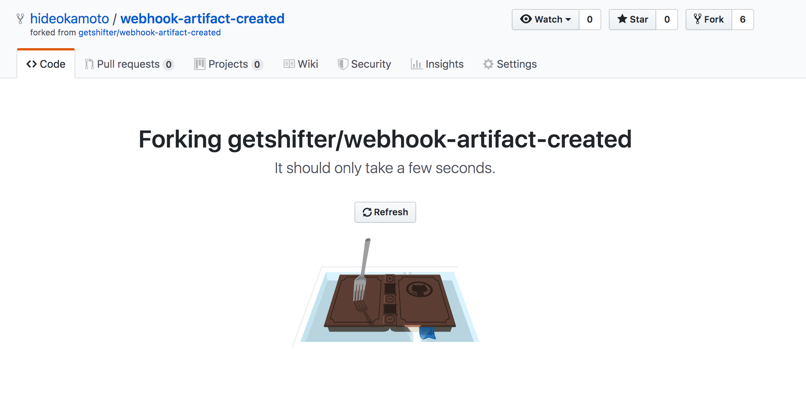

# Step2: Netlifyデプロイ用のテンプレートをインポートする
Webhookが利用可能になりましたので、早速設定を進めます。

## 2-1: GitHubでForkする

NetlifyにGenerateしたArtifactを公開するための設定は、以下のGitHubリポジトリにまとめています。

https://github.com/getshifter/webhook-artifact-created

URLにアクセスし、右上の[Fork]ボタンで自身のアカウントでForkしましょう。



Forkが完了したら準備OKです。


## 2-2: ちょっとだけ仕組みを読んでみる

Netlifyのデプロイでは、`./netlify/deploy.sh`が実行されます。

これは以下のようなタスクを実行しています。

```bash
# Webhookで送信されたダウンロードURLからArtifactをDLする
$ wget -O "${ARTIFACT_ID}.tgz" "${DOWNLOAD_URL}"

# DLしたファイルを解凍する
$ tar xvzf "${ARTIFACT_ID}".tgz

# Netlifyで公開ディレクトリに指定した場所へ、静的ファイルを移動する
$ mv "${ARTIFACT_ID}" public
```

`_headers`や`_redirect`など、Netlify用に追加したいファイルがある場合は、この`./netlify/deploy.sh`に処理を追加してカスタマイズしましょう。


## Checklist
- [ ] リポジトリをforkした
- [ ] デプロイ時の処理についてざっと把握した
- [ ] カスタマイズ方法をざっと理解した


## Navigation
- [Step1: Webhook対応プランに変更する](./step1.md)
- Now -> [Step2: Netlifyデプロイ用のテンプレートをインポートする](./step2.md)
- [Step3: Netlifyにサイトを作成する](./step3.md)
- [Step4: ShifterサイトからWebhookでデプロイする](./step4.md)
- [Tier Down: プランをダウングレードする](./tierdown.md)
- [Advanced challenge](./advanced.md)