# Step3: Netlifyにサイトを作成する

## 3-1: サイトを作成する
Netlifyにログインします。
https://app.netlify.com/

[New site from Git]をクリックし、サイトを作成します。
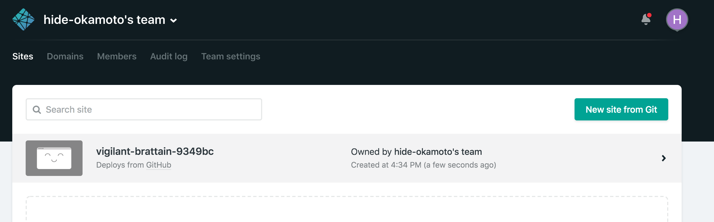

[GitHub]を指定し、認証を許可します。
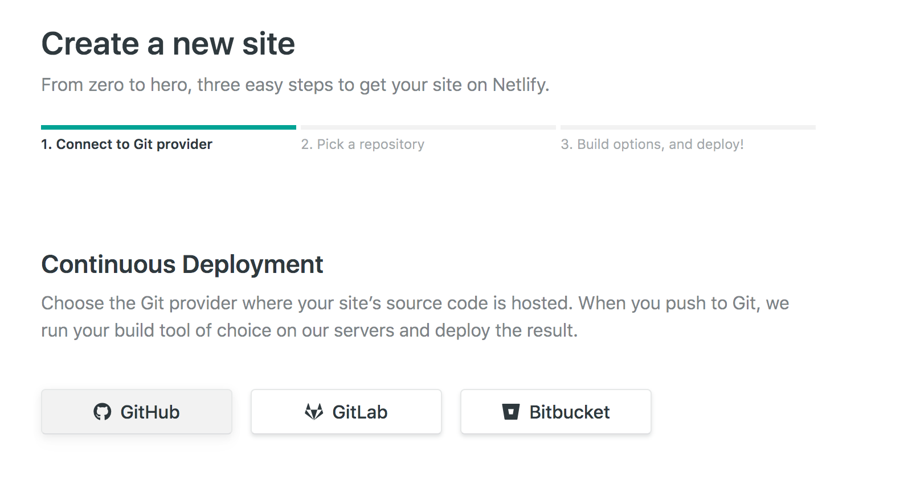

先程作成したリポジトリを選びます。

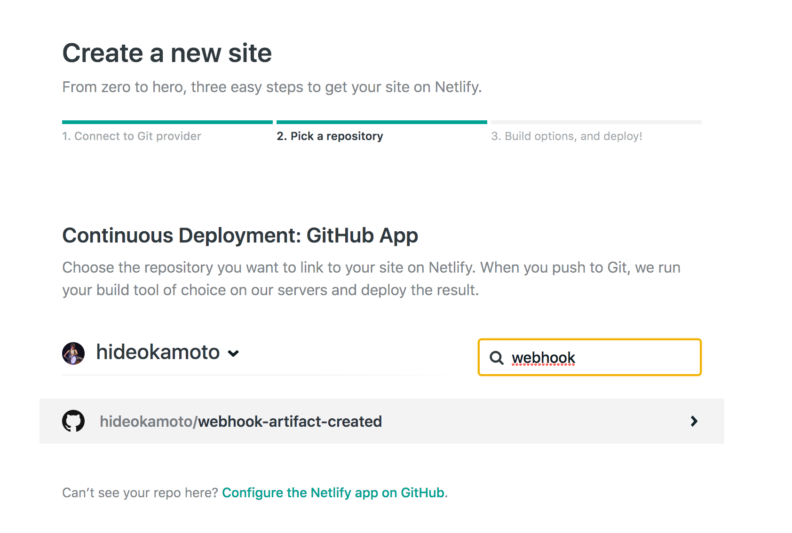

ビルドの設定は以下のような設定にします。

|項目|値|備考|
|:--|:--|:--|
|Owner|<あなたのユーザー名>'s team|ここはどんな値でもOK|
|Branch to deploy|master||
|Build command|bash -x ./netlify/deploy.sh||
|Public directory|public||

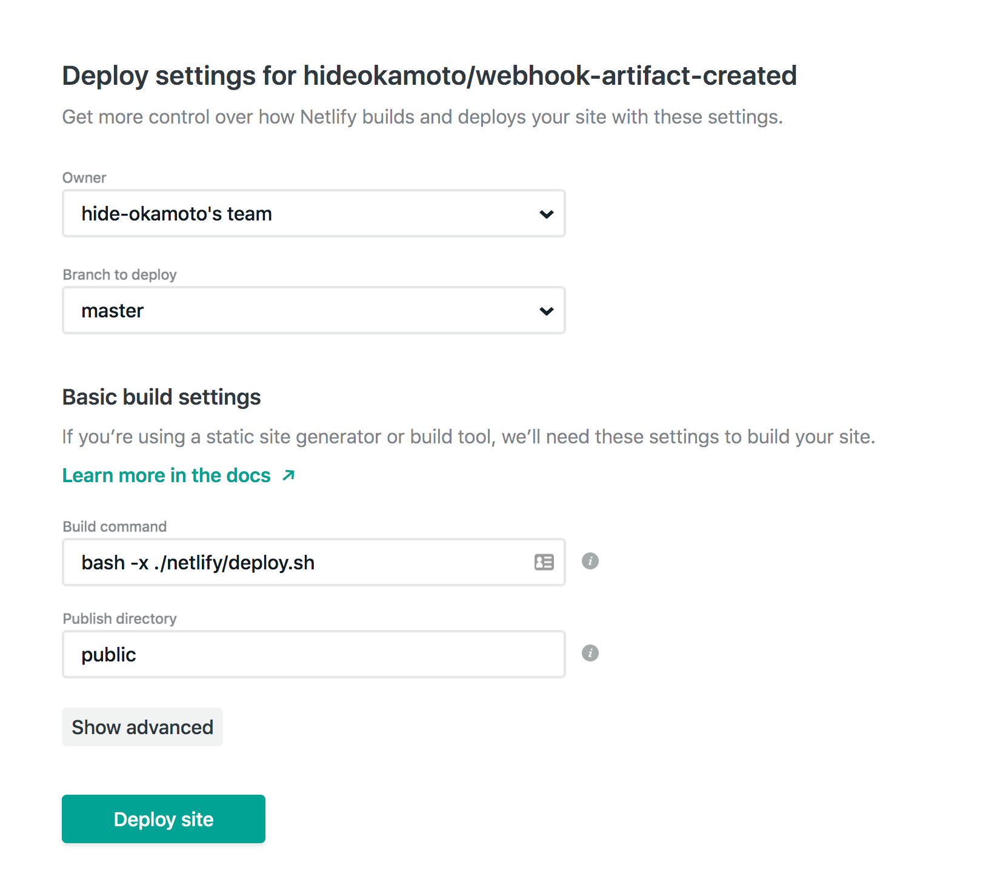

最後に[Deploy site]をクリックすればOKです。

### Note:初回のビルドについて
設定が終わると、Netlifyが初回のビルドを開始します。  
しかし次のステップのビルド方法でなければ、WordPressのURLが存在しない状態のため必ず失敗します。

Failの通知や表示が出ますが、慌てずに次のステップに移りましょう。

## 3-2: Webhook URLを取得する

### Netlify WebhookのURLを取得する
Netlifyの管理画面を開き、先程作成したサイトを選択します。
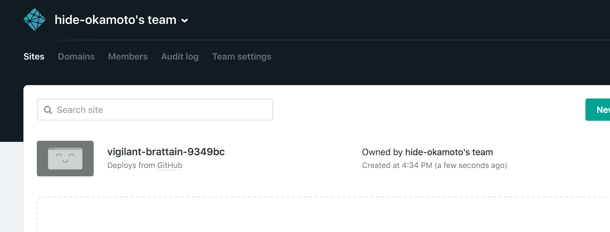

[Deploys]を選択します。
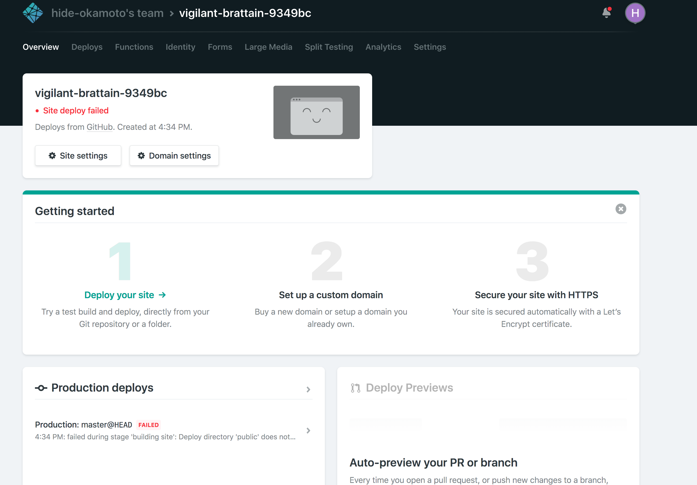

[Deploy Settings]を選択します。
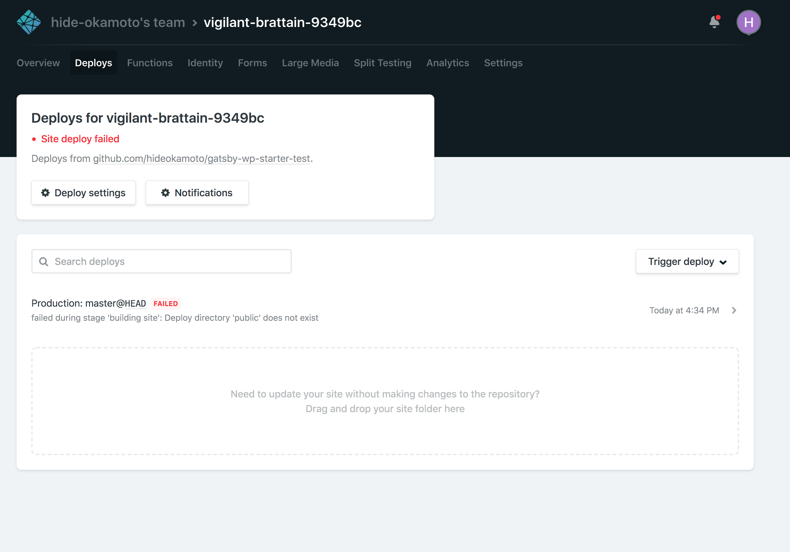

スクロールして[Build hooks]を表示します。

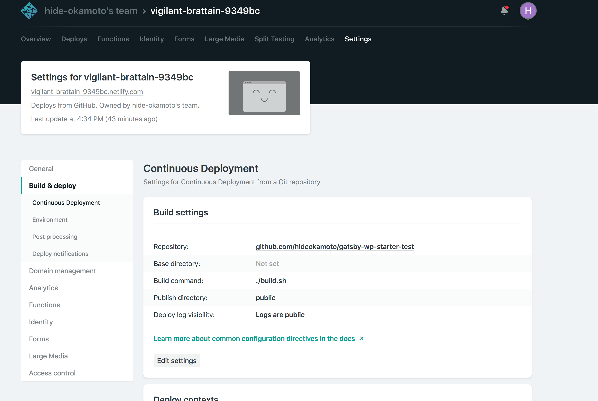

[Add build hook]をクリックします。
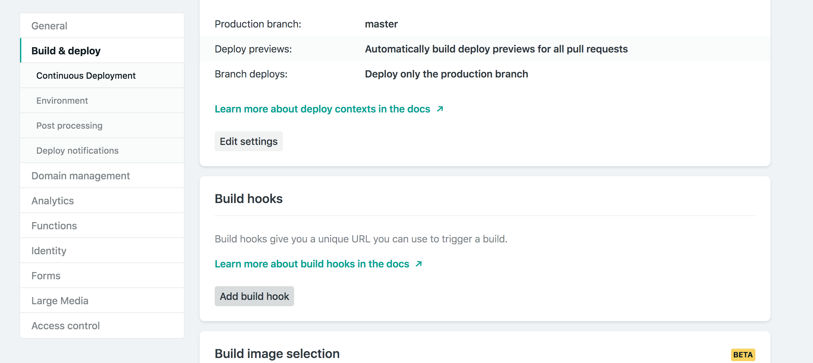

[Name]にShifterのビルドで使用するということを書きます。
Branchはmasterのまま、[Save]をクリックします。

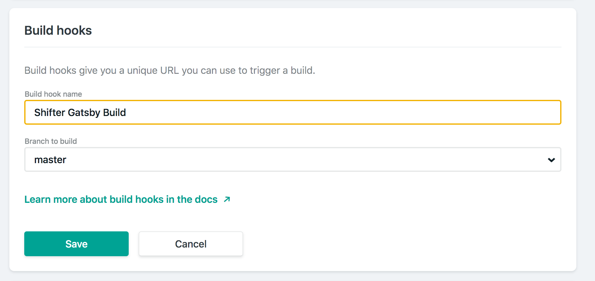
作成されたWebhookのURLをコピーします。

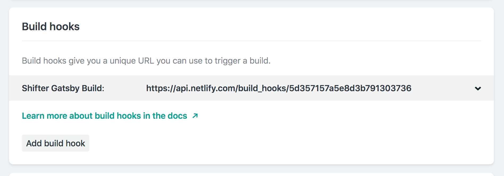

## Checklist
- [ ] Netlifyでサイトを作成した
- [ ] Netlifyのデプロイ設定を行った
- [ ] 初回のビルドが実行され、failした
- [ ] NetlifyのWebhook URLを取得した

## Navigation
- [Step1: Webhook対応プランに変更する](./step1.md)
- [Step2: Netlifyデプロイ用のテンプレートをインポートする](./step2.md)
- Now -> [Step3: Netlifyにサイトを作成する](./step3.md)
- [Step4: ShifterサイトからWebhookでデプロイする](./step4.md)
- [Tier Down: プランをダウングレードする](./tierdown.md)
- [Advanced challenge](./advanced.md)