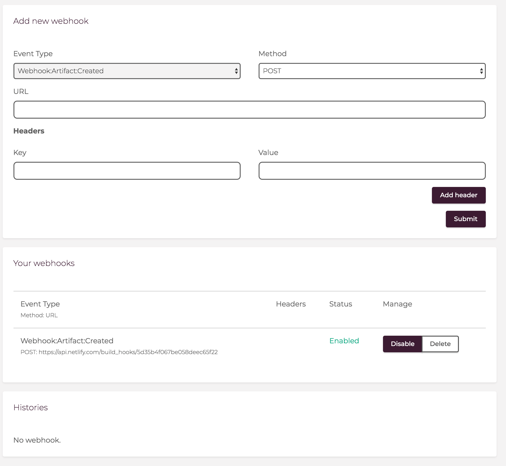

# Step4: ShifterサイトからWebhookでデプロイする
最後にいよいよShifterで生成した静的ファイルをNetlifyへデプロイしていきます。

## 4-1: Webhookを設定する
Webhookデプロイを設定したいサイトに移動し、[Webhooks]へ移動します。

[Add new webhook]で以下のように入力します。

- Event Type: Webhook:Artifact:Created
- Method: POST
- URL: <Step3で取得したNetlifyのWebhook URL>

設定を確認し、[Submit]をクリックしましょう。

[Your Webhooks]に追加されれば設定完了です。

なお、Webhookは`Disable`にすることで一時的に停止することも可能です。

## 4-2: GenerateしてWebhookを実行する

[Site Overview]に移動し、　[Generate Artifact]から[Generate]を実行します。

Generateが成功すると、Webhook経由でNetlifyのビルドが開始されます。

Shifter Dashboardの[Webhooks]からNetlifyのWebhookを実行した結果が確認できます。
こちらはあくまでAPI呼び出し結果のみで、ビルドの結果についてはNetlify側で確認する必要があります。

## 4-3: Netlifyで公開されていることを確認する

Netlify側でデプロイが成功していることを確認しましょう。

[Published]になっていれば、画面に表示されている[XXXX.netlify.com]のURLからNetlifyにデプロイされたWordPressサイトを確認できます。

## Checklist
- [ ] ShifterでWebhookを設定した
- [ ] Generateを実行し、WebhookでNetlifyと連携した
- [ ] Netlifyでビルドが成功した
- [ ] Netlifyでサイトが公開された

## まとめ
ShifterはWebhookを利用することで、Generateが完了した時にDL URLを任意のURLに送信できます。  
NetlifyやAmazon S3などの外部サーバにデプロイするスクリプトとAPIを用意することで、より柔軟なサイト運営が可能です。

またNetlifyを利用することで、Form / FunctionやA/Bテスト、Slack通知といったNetlifyが提供するホスティング機能を利用することもできます。

## Navigation
- [Step1: Webhook対応プランに変更する](./step1.md)
- [Step2: Netlifyデプロイ用のテンプレートをインポートする](./step2.md)
- [Step3: Netlifyにサイトを作成する](./step3.md)
- [Step4: ShifterサイトからWebhookでデプロイする](./step4.md)
- -> [Tier Down: プランをダウングレードする](./tierdown.md)
- [Advanced challenge](./advanced.md)