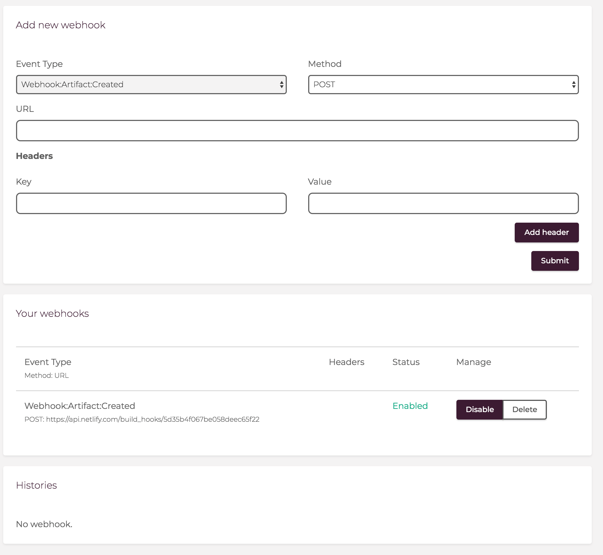
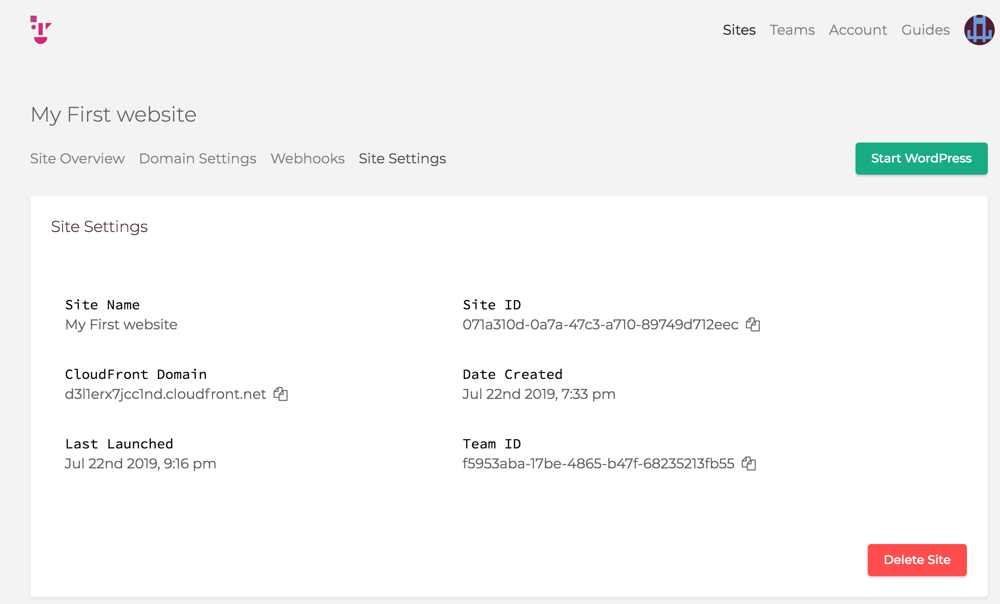
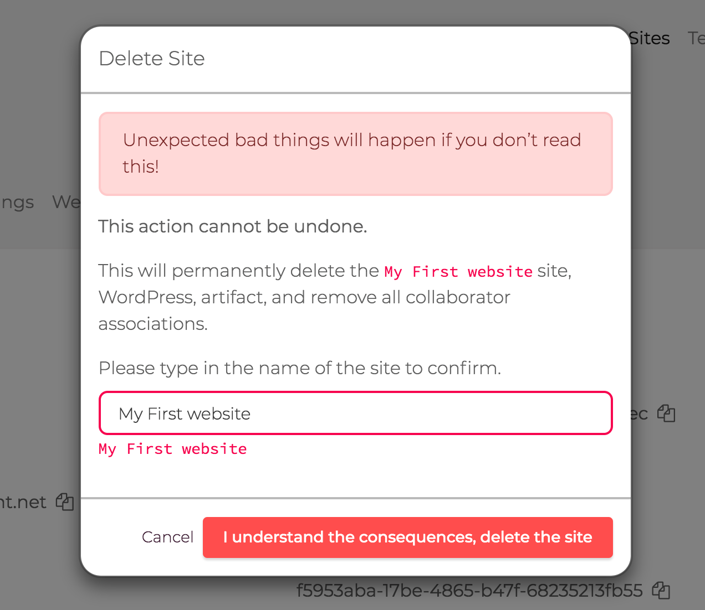
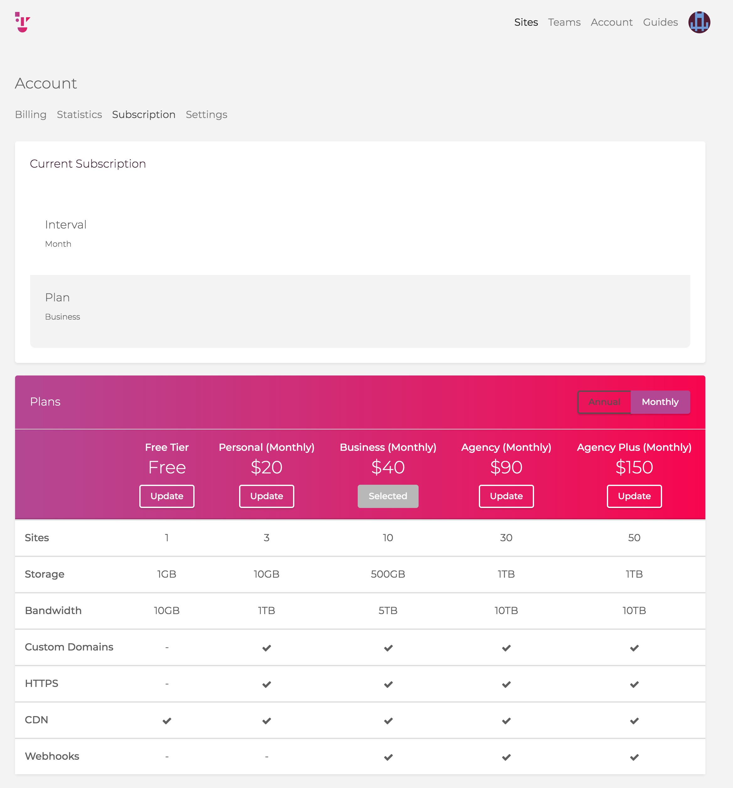
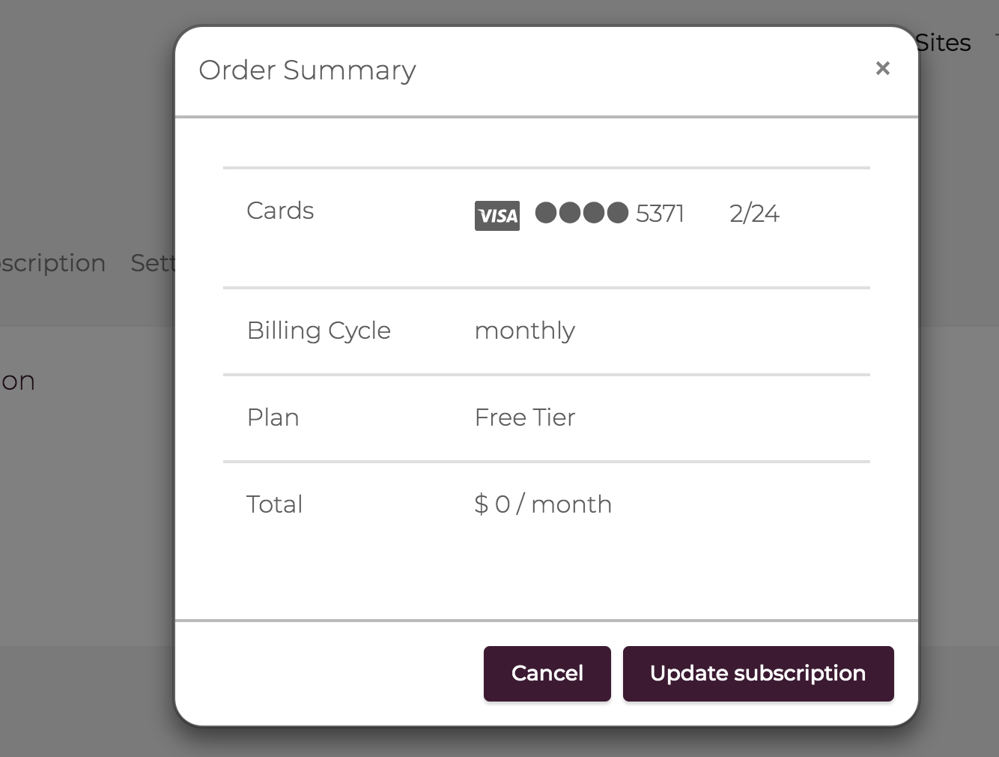

# Tier Down: プランをダウングレードする
最後にプランをFreeに戻しましょう。

## T-1: Webhookをdeleteする
[Webhooks]の[Your Webhooks]から登録したWebhookを[Delete]しましょう。

## T-2: サイトの数を1サイト未満にする
複数のサイトを作成した場合、[Site Settings]から[Delete Site]で1サイト以外すべて削除しましょう。

サイト名を入力する必要がありますのでご注意ください・

## T-3: プランをダウングレードする

[Account > Subscription]からFreeプランを選択します。

https://go.getshifter.io/admin/accounts/subscription

Freeプランに変更されていればOKです。

## Navigation
- [Step1: Webhook対応プランに変更する](./step1.md)
- [Step2: Netlifyデプロイ用のテンプレートをインポートする](./step2.md)
- [Step3: Netlifyにサイトを作成する](./step3.md)
- [Step4: ShifterサイトからWebhookでデプロイする](./step4.md)
- Now -> [Tier Down: プランをダウングレードする](./tierdown.md)
- [Advanced challenge](./advanced.md)